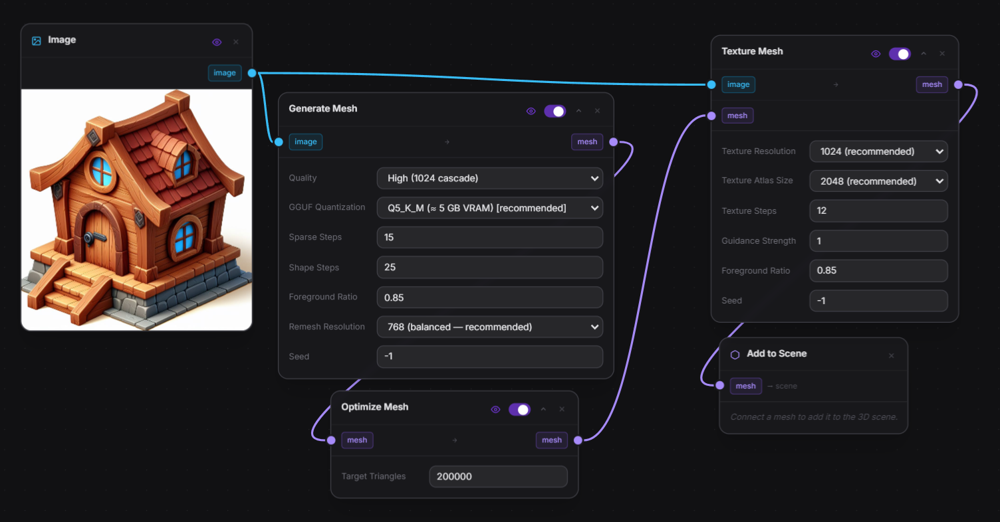

# Trellis.2 GGUF — Modly Extension

Convert a single image into a 3D mesh in one pass, using the [Trellis.2 GGUF](https://huggingface.co/Aero-Ex/Trellis2-GGUF) model by Aero-Ex. Quantized weights keep VRAM usage between 4 and 8 GB depending on the selected quantization level.

---

## Basic workflow

The workflow above is the recommended starting point. It chains the two nodes back-to-back:

1. **Generate Mesh** — takes an image and produces a geometry-only GLB
2. **Texture Mesh** — takes the same image and the generated mesh, and bakes textures onto it

---

## Nodes

### Generate Mesh

| Parameter | Description | Default |
|---|---|---|
| `image` | Input image (any background — it will be removed) | — |
| `pipeline` | Quality preset: `fast` (512), `balanced` (1024), `high` (1024 cascade), `ultra` (1536 cascade) | `balanced` |
| `quantization` | GGUF quant level (Q4_K_M → Q8_0). Lower = less VRAM, less quality | `Q5_K_M` |
| `ss_steps` | Sparse-structure diffusion steps | `25` |
| `slat_steps` | Shape SLaT diffusion steps | `25` |
| `foreground_ratio` | How much of the frame the subject should fill (0–1) | `0.85` |
| `remesh_resolution` | Dual-contouring grid resolution for the output mesh | `256` |
| `seed` | Reproducibility seed | `0` |

**Output:** geometry GLB (no texture)

### Texture Mesh

| Parameter | Description | Default |
|---|---|---|
| `image` | Same input image used for generation | — |
| `mesh` | GLB mesh to texture (from Generate Mesh) | — |
| `texture_resolution` | Texture map size in pixels | `1024` |
| `atlas_size` | UV atlas packing resolution | `2048` |
| `texture_steps` | Texture diffusion steps | `12` |
| `guidance_strength` | CFG guidance for texture diffusion | `3.0` |
| `foreground_ratio` | Should match the value used in Generate Mesh | `0.85` |
| `seed` | Reproducibility seed | `0` |

**Output:** textured GLB

---

## Model source

Weights: [Aero-Ex/Trellis2-GGUF](https://huggingface.co/Aero-Ex/Trellis2-GGUF) on HuggingFace  
Based on: [microsoft/TRELLIS](https://github.com/microsoft/TRELLIS)
